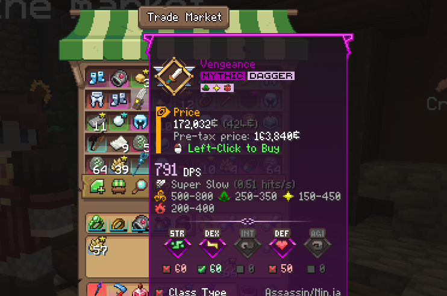

# Wynncraft Market Price Helper

## Description
This mod is designed to use on Wynncraft server in Minecraft. It adds a line to the item lore of items in the Trade Market indicating the initial price of the item - before the 5% Trade Market tax.

Makes it useful for when you want to calculate the item price needed to undercut the currently cheapest available offer.

## Usage
The mod automatically injects a line into the item lore whenever it detects the item is a listing while hovering over it. The player can customize:
* Type of the output
  * Integer (truncated)
  * Decimal
* Color of the output

