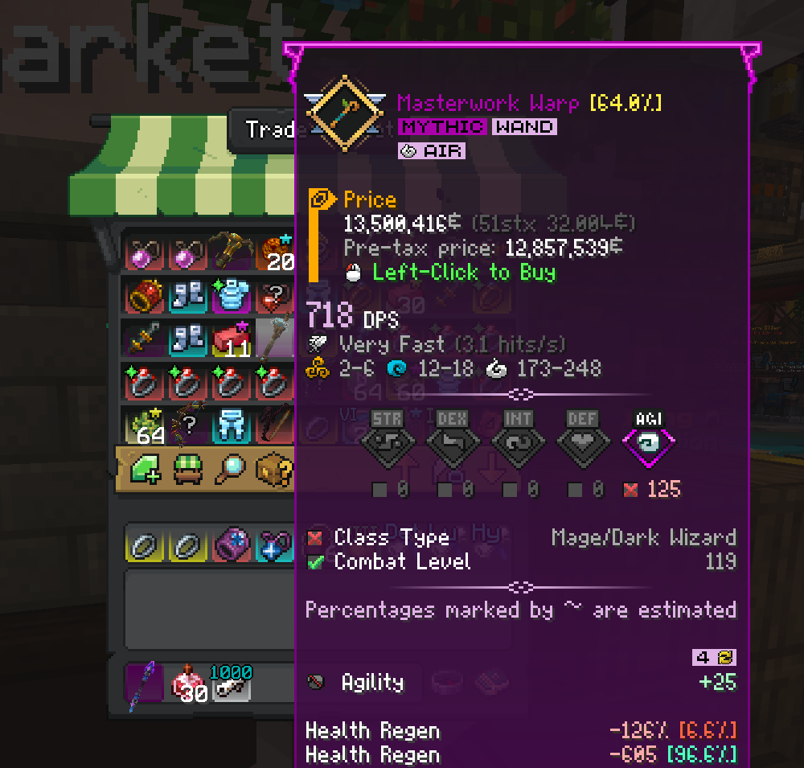

# Wynncraft Market Price Helper

## Description
This mod is designed to be used on Wynncraft server in Minecraft. It adds a line to the item lore of items in the Trade Market indicating the initial price of the item - before the Trade Market tax.

Makes it useful for when you want to calculate the item price needed to undercut the currently cheapest available offer.

## Usage
The mod automatically injects a line into the item lore whenever it detects the item is a Trade Market listing while hovering over it. Within the mod menu the player can customize:
* Tax rate used in calculations
  * 3% (with Silverbull subscription)
  * 5% (without Silverbull subscription)
* Display type
  * Integer (truncated)
  * Decimal
* Colors of the added line

